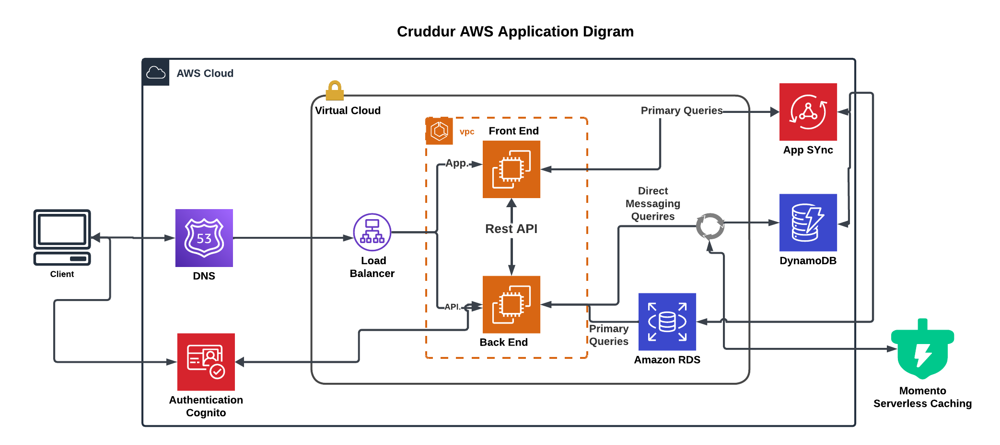

# AWS Cloud Project Bootcamp

- Application: Cruddur

**The project involves building a micro-blogging platform for a startup company, where you will serve as the first cloud engineer. The application is divided into a frontend and a backend, utilizing specific technologies and tools to ensure a scalable and efficient development process.**

## Project Components

### Frontend Development:
Technology: The frontend will be built using React, a popular JavaScript library for building user interfaces, particularly single-page applications (SPAs).
Focus: The emphasis is on using functional components, which are simpler and promote better performance and easier testing compared to class components.
User Experience: The frontend will handle user interactions, display posts, allow users to create new posts, and manage user accounts.

### Backend Development:
Technology: The backend will utilize Flask, a lightweight Python web framework. Flask is chosen for its simplicity and flexibility, making it ideal for building RESTful APIs.

API Design: The backend will expose endpoints for CRUD (Create, Read, Update, Delete) operations on blog posts, user authentication, and other necessary functionalities.

Database: While not explicitly mentioned, a database (like PostgreSQL or MongoDB) will likely be integrated to store user data and posts.

## Tools and Technologies

### Version Control with GitHub:
Repositories: You will fork existing repositories for the frontend and backend applications. This allows them to work on their own copies while maintaining the original codebase.
Collaboration: GitHub facilitates collaboration, enabling multiple developers to work on the same project, track changes, and manage issues.

### Cloud Development Environment with Gitpod:

Setup: Gitpod provides a pre-configured development environment that can be launched directly from GitHub repositories. This eliminates the need for local setup and ensures consistency across development environments.
Configuration: You will create a gitpod.yml file to customize their workspace, including specifying VSCode extensions and other settings.

### Containerization with Docker:

Dockerfiles: You will write Dockerfiles for both the frontend and backend applications. A Dockerfile is a script that contains instructions on how to build a Docker image, which encapsulates the application and its dependencies.
Docker Compose: This tool will be used to define and run multi-container Docker applications. You will create a docker-compose.yml file to orchestrate the frontend and backend containers, allowing them to run side by side.

### Deployment on AWS:

Cloud Services: The application will be deployed on AWS, taking advantage of various services such as EC2 (Elastic Compute Cloud) for hosting, RDS (Relational Database Service) for database management, and S3 (Simple Storage Service) for static file storage.

Cost Management: You will learn to monitor and manage AWS costs effectively, ensuring that the application remains within budget.

## Development Workflow
Initial Setup:

Register for GitHub and Gitpod accounts.
Fork the provided repositories and set up the development environment in Gitpod.
Code Exploration:

Clone the frontend and backend repositories into the Gitpod workspace.
Explore the codebases to understand the existing structure and functionality.
Containerization:

Write Dockerfiles for both applications to define how they should be built and run in containers.
Use Docker Compose to create a configuration that allows both containers to run together, facilitating local development.
Testing and Iteration:

Run the applications locally using Docker to ensure they function as expected.
Make necessary adjustments based on testing results and feedback.
Deployment:

Once the applications are containerized and tested, deploy them to AWS.
Set up necessary AWS services, configure networking, and ensure security best practices are followed.
Monitoring and Maintenance:

Implement monitoring solutions to track application performance and health.
Regularly update the applications and infrastructure based on user feedback and evolving requirements.

## AWS resources and services
In the context of building the micro-blogging platform as described in the bootcamp outline, several AWS resources and services will be utilized to ensure a robust, scalable, and efficient application. Here’s a breakdown of the key AWS services that are likely to be used throughout the project:

1. Amazon EC2 (Elastic Compute Cloud)
Purpose: Provides resizable compute capacity in the cloud. EC2 instances can be used to host the backend application if not using serverless options.
Use Case: Running the Flask backend application in a virtual server environment.

2. Amazon ECS (Elastic Container Service)
Purpose: A fully managed container orchestration service that allows you to run and manage Docker containers.
Use Case: Deploying the containerized backend application using ECS Fargate, which allows running containers without managing servers.

3. Amazon ECR (Elastic Container Registry)
Purpose: A fully managed Docker container registry that makes it easy to store, manage, and deploy Docker container images.
Use Case: Storing the Docker images for the frontend and backend applications before deploying them to ECS.

4. AWS Lambda
Purpose: A serverless compute service that runs code in response to events and automatically manages the compute resources.
Use Case: Offloading background jobs or handling specific API requests without provisioning servers.

5. Amazon RDS (Relational Database Service)
Purpose: A managed relational database service that supports several database engines (e.g., MySQL, PostgreSQL).
Use Case: Storing user data and blog posts in a relational database, providing scalability and automated backups.

6. Amazon S3 (Simple Storage Service)
Purpose: An object storage service that offers industry-leading scalability, data availability, security, and performance.
Use Case: Storing static assets such as images, videos, or other media files related to blog posts.

7. Amazon API Gateway
Purpose: A fully managed service that makes it easy to create, publish, maintain, monitor, and secure APIs at any scale.
Use Case: Exposing the backend Flask API endpoints to the frontend application and managing API requests.

8. AWS IAM (Identity and Access Management)
Purpose: Enables you to manage access to AWS services and resources securely.
Use Case: Setting up roles and permissions for users and services to ensure secure access to AWS resources.

9. Amazon CloudWatch
Purpose: A monitoring and observability service that provides data and insights to monitor applications, respond to system-wide performance changes, and optimize resource utilization.
Use Case: Monitoring application performance, logging, and setting up alarms for specific metrics.

10. AWS Route 53
Purpose: A scalable and highly available Domain Name System (DNS) web service.
Use Case: Managing the domain name for the application and routing traffic to the appropriate resources.

11. AWS CloudFormation
Purpose: A service that helps you model and set up your Amazon Web Services resources so that you can spend less time managing those resources and more time focusing on your applications.
Use Case: Using Infrastructure as Code (IaC) to define and provision the AWS infrastructure needed for the application.

12. AWS CodePipeline
Purpose: A continuous integration and continuous delivery (CI/CD) service for fast and reliable application and infrastructure updates.
Use Case: Automating the build, test, and deployment phases of the application lifecycle.

13. AWS CodeBuild
Purpose: A fully managed build service that compiles source code, runs tests, and produces software packages that are ready to deploy.
Use Case: Building Docker images and preparing them for deployment to ECR.

14. AWS SNS (Simple Notification Service)
Purpose: A fully managed messaging service for both application-to-application and application-to-person communication.
Use Case: Sending notifications based on events, such as service health issues.

### Summary
These AWS services collectively provide a comprehensive infrastructure for developing, deploying, and managing the micro-blogging platform. They enable scalability, reliability, and efficient resource management, which are crucial for modern cloud applications , , . By leveraging these services, the project can effectively handle user traffic, store data securely, and ensure a smooth user experience.

## Learning Outcomes
Gain practical knowledge of working within a cloud development environment.
Understand how to navigate and integrate backend and frontend applications.
Develop skills in using Docker for local development and deployment.

## Journaling 

The `/journal` directory contains

- [ ] [Week 0](journal/week00.md)
- [ ] [Week 1](journal/week01.md)
- [ ] [Week 2](journal/week02.md)
- [ ] [Week 3](journal/week03.md)
- [ ] [Week 4](journal/week04.md)
- [ ] [Week 5](journal/week05.md)
- [ ] [Week 6](journal/week06.md)
- [ ] [Week 7](journal/week07.md)
- [ ] [Week 8](journal/week08.md)
- [ ] [Week 9](journal/week09.md)
- [ ] [Week 10](journal/week10.md)
- [ ] [Week 11](journal/week11.md)
- [ ] [Week 12](journal/week12.md)
- [ ] [Week 13](journal/week13.md)
